# Schweizer Gemeinde und Kantons Wappen

Sammlung aller Schweizer Wappen als SVG — 26 Kantone und 2'100+ Gemeinden.

## Struktur

```
cantons/          # 26 Kantonswappen, benannt nach Kürzel (ZH.svg, BE.svg, …)
municipalities/   # ~2'110 Gemeindewappen, benannt nach BFS-Nummer (261.svg, 351.svg, …)
```

### Kantone

Dateien sind nach dem offiziellen Kantonskürzel benannt:

<table>
  <tr>
    <td align="center">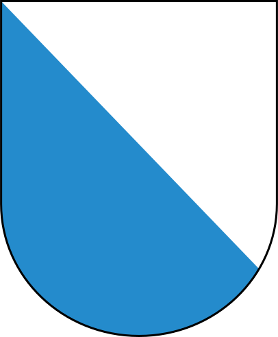<br><sub>ZH</sub></td>
    <td align="center">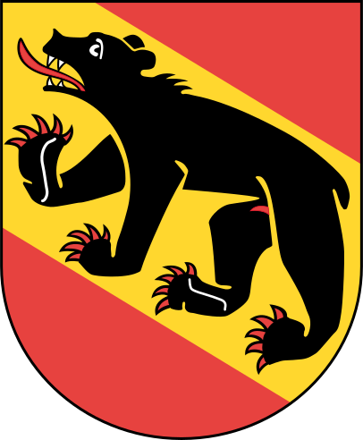<br><sub>BE</sub></td>
    <td align="center">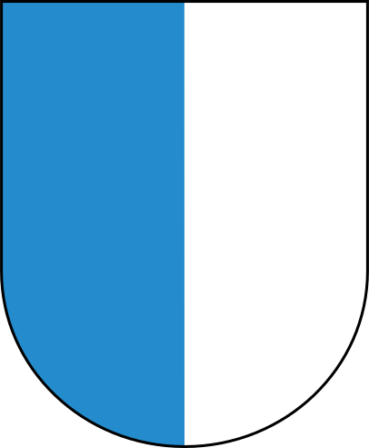<br><sub>LU</sub></td>
    <td align="center">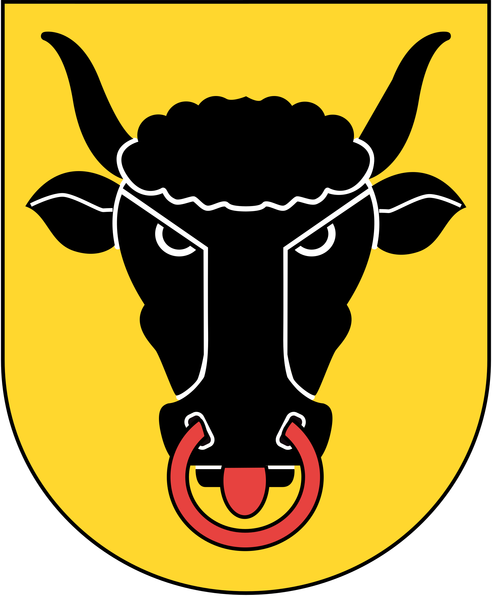<br><sub>UR</sub></td>
    <td align="center">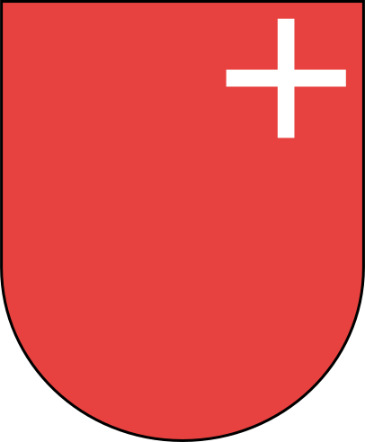<br><sub>SZ</sub></td>
    <td align="center">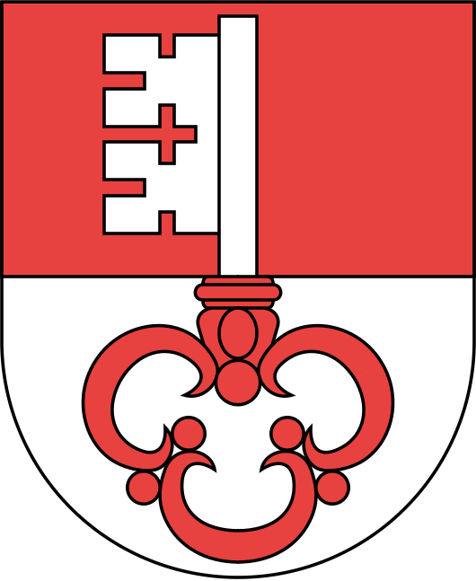<br><sub>OW</sub></td>
    <td align="center">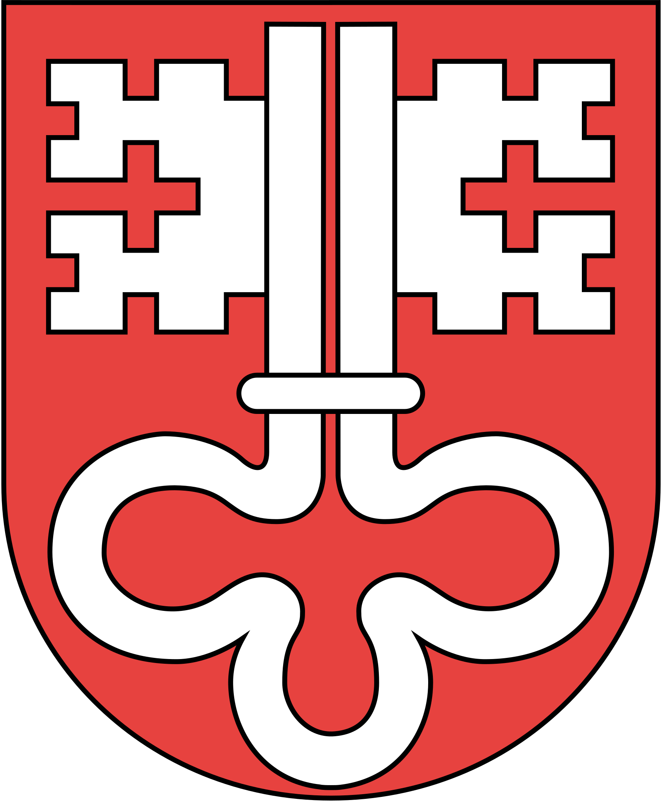<br><sub>NW</sub></td>
    <td align="center">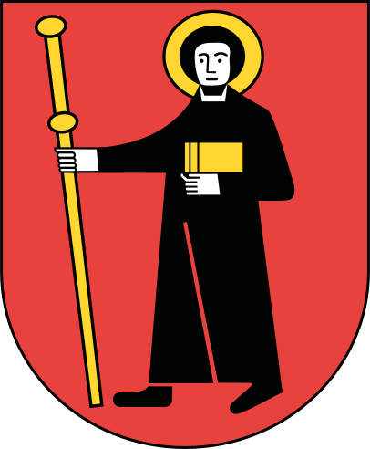<br><sub>GL</sub></td>
    <td align="center">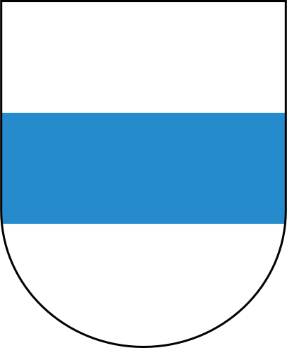<br><sub>ZG</sub></td>
  </tr>
  <tr>
    <td align="center">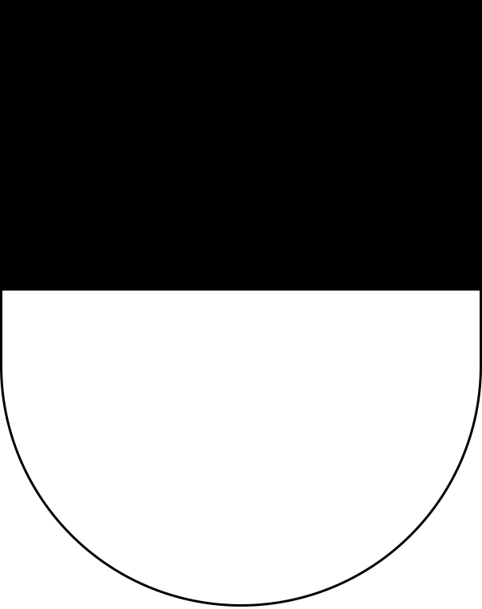<br><sub>FR</sub></td>
    <td align="center">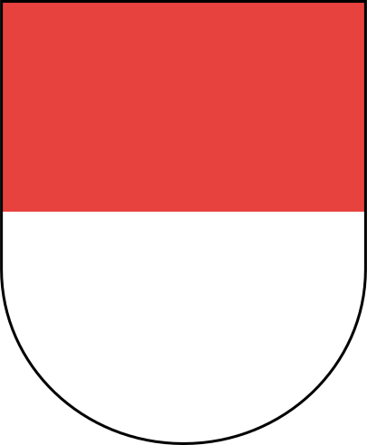<br><sub>SO</sub></td>
    <td align="center">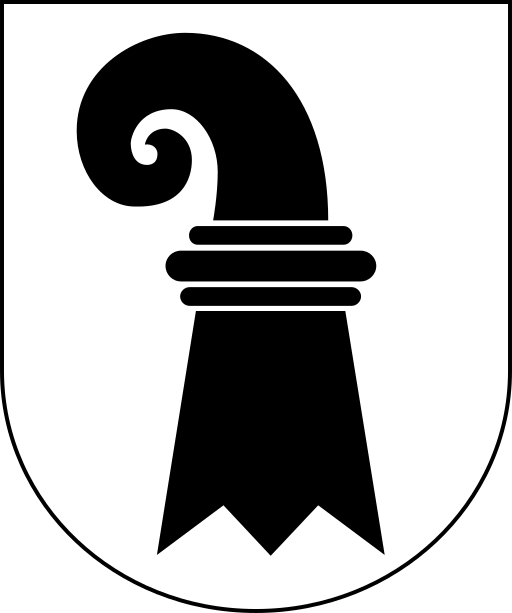<br><sub>BS</sub></td>
    <td align="center">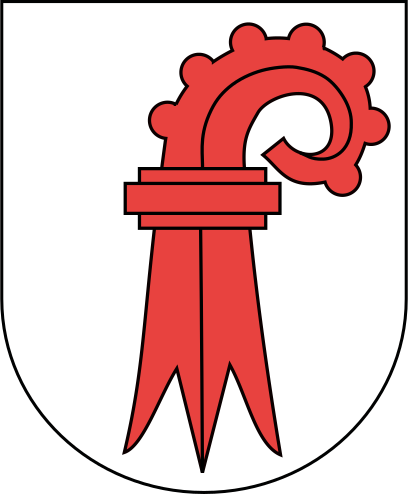<br><sub>BL</sub></td>
    <td align="center">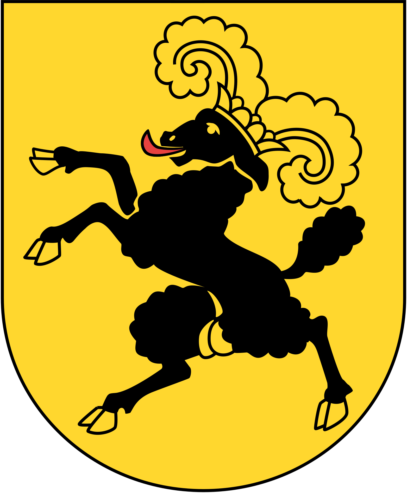<br><sub>SH</sub></td>
    <td align="center">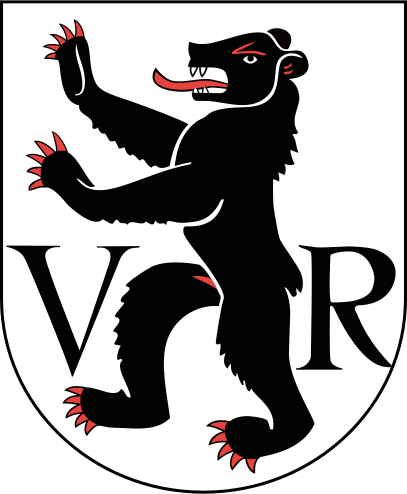<br><sub>AR</sub></td>
    <td align="center">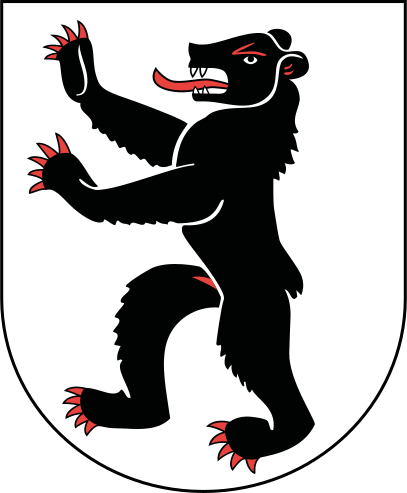<br><sub>AI</sub></td>
    <td align="center">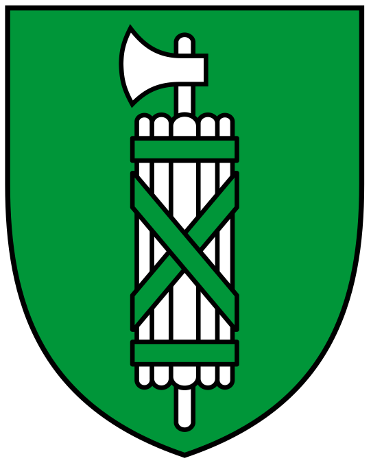<br><sub>SG</sub></td>
    <td align="center">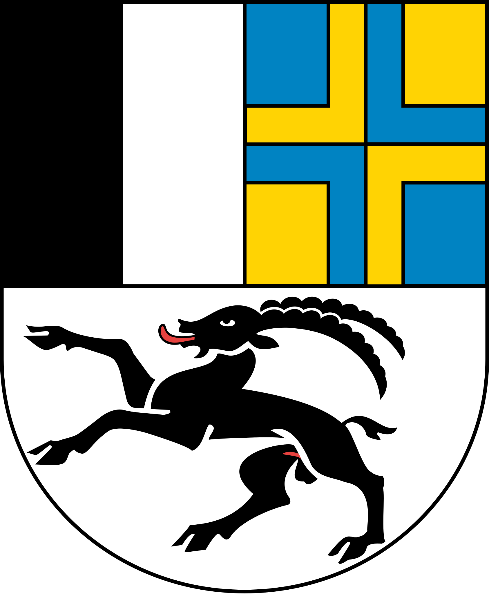<br><sub>GR</sub></td>
  </tr>
  <tr>
    <td align="center">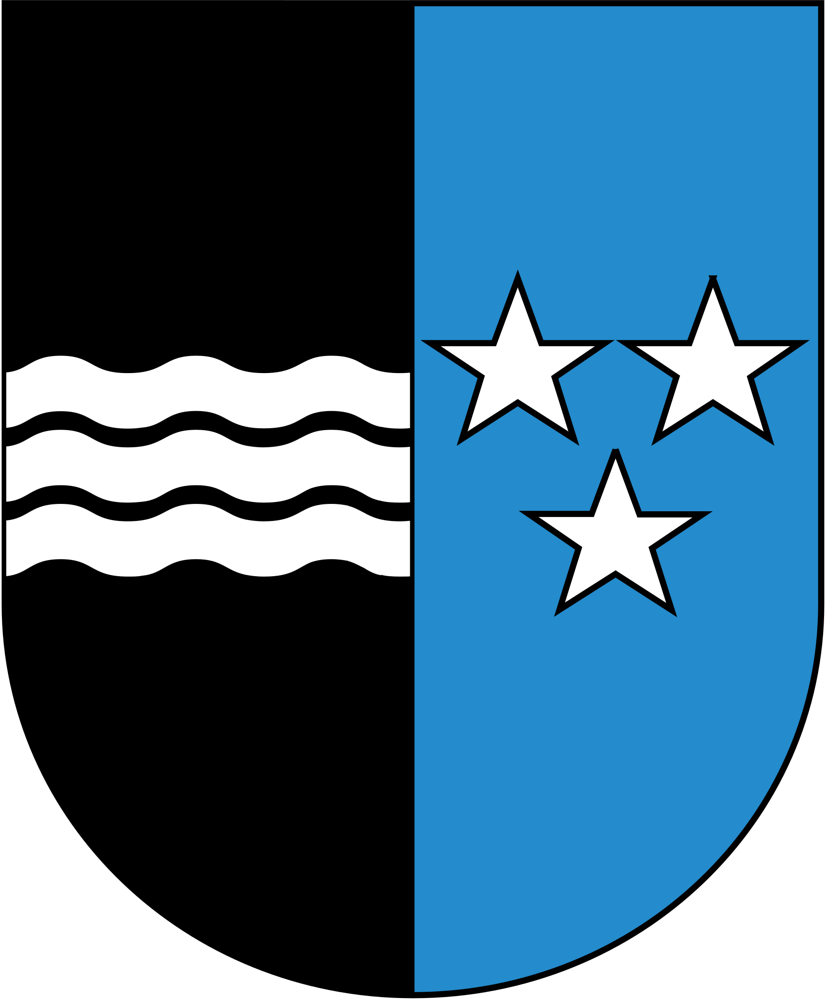<br><sub>AG</sub></td>
    <td align="center">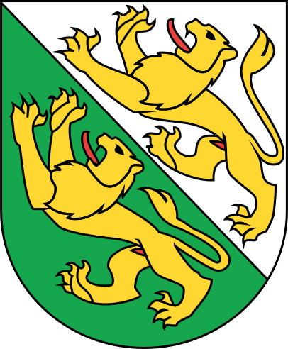<br><sub>TG</sub></td>
    <td align="center">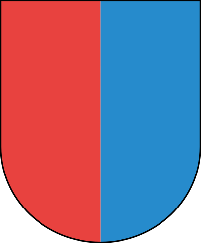<br><sub>TI</sub></td>
    <td align="center">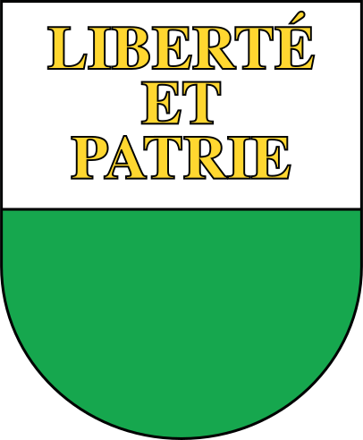<br><sub>VD</sub></td>
    <td align="center">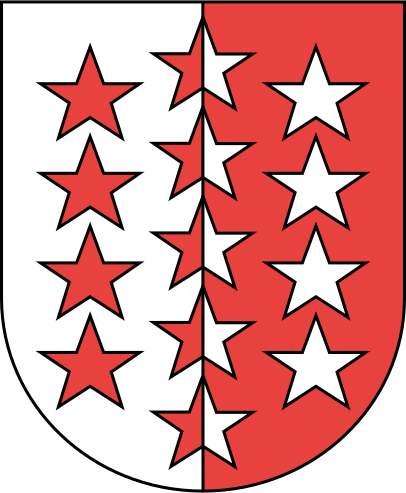<br><sub>VS</sub></td>
    <td align="center">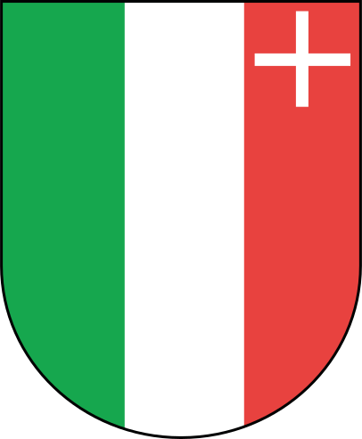<br><sub>NE</sub></td>
    <td align="center">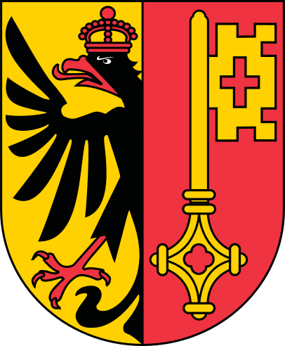<br><sub>GE</sub></td>
    <td align="center">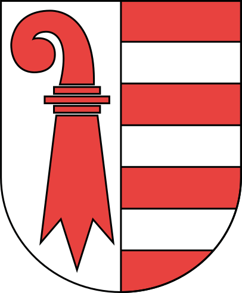<br><sub>JU</sub></td>
    <td></td>
  </tr>
</table>

### Gemeinden

Dateien sind nach der offiziellen [BFS-Gemeindenummer](https://www.bfs.admin.ch/bfs/de/home/grundlagen/agvch.html) benannt. Beispiel: Zürich = `261.svg`, Bern = `351.svg`.

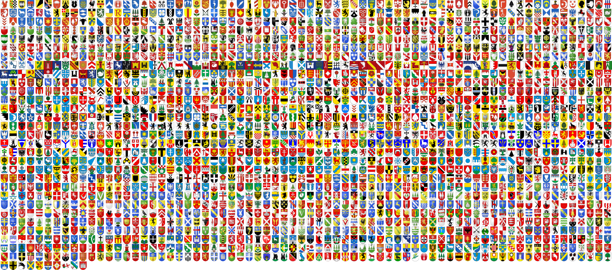

BFS-Nummern nachschlagen: [Offizielles Gemeindeverzeichnis (BFS)](https://www.bfs.admin.ch/bfs/de/home/grundlagen/agvch.html).

## Abdeckung

| Typ | Vorhanden | Vektor | Raster-in-SVG | Abdeckung |
|-----|-----------|--------|---------------|-----------|
| Kantone | 26/26 | 26 | 0 | 100% |
| Gemeinden | ~2'110/~2'136 | ~1'800 | ~310 | ~99% |

> ~310 Gemeindewappen sind Rasterbilder (PNG/GIF) in einem SVG-Wrapper. Sie werden korrekt dargestellt, sind aber keine echten Vektorgrafiken. Beiträge zum Ersetzen durch echte Vektor-SVGs sind willkommen.

### Fehlende Gemeinden

| BFS | Name | Kanton |
|-----|------|--------|
| 2391 | Staatswald Galm | FR |
| 3234 | Diepoldsau | SG |
| 5391 | Comunanza Cadenazzo/Monteceneri | TI |
| 6119 | Turtmann-Unterems | VS |
| 6730 | Val Terbi | JU |
| 6809 | Haute-Ajoie | JU |

## Verwendung

```html

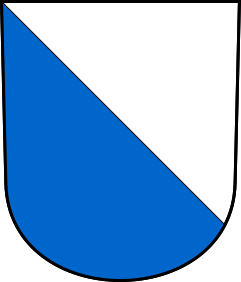
```

## Quellen & Qualität

- Kantonswappen von offiziellen Kantonswebsites und Wikimedia Commons — alle echte Vektorgrafiken
- Gemeindewappen von offiziellen Gemeindewebsites, kantonalen Portalen und Wikimedia Commons
- ~85% der Gemeindedateien sind echte Vektor-SVGs, ~15% sind eingebettete Rasterbilder (siehe Abdeckung)

## Lizenz

Wappen sind als offizielle heraldische Insignien gemeinfrei. Die SVG-Dateien in diesem Repository stehen unter der [MIT-Lizenz](LICENSE).

**Hinweis:** Einzelne Gemeinden können Markenrechte an ihrem Wappen halten. Bei kommerzieller Nutzung im grossen Stil empfehlen wir eine Prüfung der lokalen Bestimmungen.

## Mitmachen

Pull Requests sind willkommen — besonders für fehlende Gemeinden oder bessere SVG-Qualität:

- Dateien sollten saubere Vektor-SVGs sein (keine eingebetteten Rasterbilder)
- Korrekt nach BFS-Nummer benannt
- Vernünftige Dateigrösse (< 100 KB)

---

Gepflegt von [Milk Interactive](https://milkinteractive.ch) — [hello@milkinteractive.ch](mailto:hello@milkinteractive.ch)
